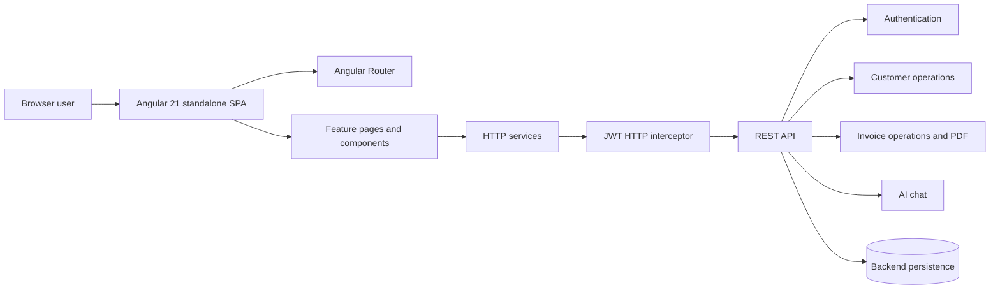

# NexusFlow

NexusFlow is a browser-based business operations application for managing customer records and the invoices associated with them. The frontend is an Angular single-page application. It provides public registration and sign-in screens, authenticated customer and invoice workflows, invoice PDF download, and a conversational AI assistant for questions about the product and business workflows.

This repository contains the **frontend only**. The application calls a separately deployed REST API; authentication, persistence, invoice generation, and AI answers are provided by that backend. The README describes behavior implemented in this codebase and labels planned or backend-owned behavior explicitly.

## Contents

- [Business overview](#business-overview)
- [Capabilities and user journeys](#capabilities-and-user-journeys)
- [Application architecture](#application-architecture)
- [Frontend design](#frontend-design)
- [Routes and access model](#routes-and-access-model)
- [Backend integration](#backend-integration)
- [Data contracts](#data-contracts)
- [Configuration](#configuration)
- [Run locally](#run-locally)
- [Build, tests, and deployment](#build-tests-and-deployment)
- [Repository map](#repository-map)
- [Known limitations and roadmap](#known-limitations-and-roadmap)

## Business overview

Small businesses often maintain customer details and billing records in separate spreadsheets and documents. That makes it harder to keep contact details current, associate bills with the right customer, understand invoice state, and retrieve a customer’s billing history.

NexusFlow brings those tasks into one interface:

1. A user creates an account and signs in.
2. The user creates and maintains customer records.
3. Invoices are created for customers, then viewed, updated, or removed as needed.
4. Invoice documents can be downloaded as PDFs from the backend.
5. Users can ask NexusFlow AI questions from the public homepage launcher or the `/ai` page.

The frontend describes an invoice as a customer-linked record containing a number, services description, amount, invoice date, creation timestamp, and status. The statuses represented by the client are `PENDING`, `PAID`, and `CANCELLED`. Business rules that validate or transition those states belong to the backend and are not defined by the frontend repository.

### Business concepts

| Concept | Meaning in the application |
| --- | --- |
| User | An authenticated person using the customer and invoice workflows. The frontend stores a JWT and basic user details in browser local storage. |
| Customer | A person or business with a name, contact information, address, type, and creation date. Types are represented as `INDIVIDUAL` and `BUSINESS` in API data. |
| Invoice | A bill associated with a customer, with a services description, total amount, date, invoice number, and lifecycle status. |
| Customer history | Customer details include invoices returned by a customer-invoices API operation. |
| AI conversation | A sequence of user and assistant messages associated with a generated conversation ID. The AI API receives each new message and returns an answer. |

## Capabilities and user journeys

### Public landing page

The root route (`/`) presents the product, customer/invoice highlights, registration and login calls to action, and a floating NexusFlow AI button. Opening the button lazily creates the chat panel; closing and reopening it keeps the active conversation in the page component. A separate `/ai` route presents the chat in a page layout.

### Registration and sign-in

- Registration collects first name, last name, email, phone, password, and password confirmation. The frontend validates required values, email format, minimum name/password lengths, and a 10-digit phone number before submitting.
- Login collects email and password. A successful response is expected to contain a token and user object inside the standard API response envelope. The app stores these values and navigates to `/dashboard`.
- Logout removes the JWT and returns the user to the public route. The current `logout()` method removes the token but does not remove the separately persisted current-user record; `clearCurrentUser()` exists but is not called by logout.

### Customer management

The customers screen loads a paginated list, currently requesting three records per page. Each row links to the customer detail view and edit form. Users can create a customer, update its details, inspect the customer’s invoices, navigate to an invoice, create an invoice for that customer, or request deletion.

The search input is currently presentation-only: its handler is a TODO and does not filter or query customer records. The list’s displayed invoice count is also currently hard-coded to zero; invoice history is loaded on the detail screen instead.

### Invoice management

The invoice list requests a page from the API and presents summary cards and invoice rows. From invoice details, a user can edit, delete, navigate to its customer, or download a PDF. Invoice creation accepts customer name, status, services, date, and total amount; it submits those fields with a customer ID in the URL. When launched from a customer details screen, that screen passes a `customerId` query parameter, although the form currently does not read that query parameter into its `customerId` property. Confirm the backend contract and wire this value through before relying on the customer-specific create flow.

The invoice list’s summary calculations run over the records currently loaded by its API request, not necessarily over every invoice in the system. The UI labels `CANCELLED` totals as “Overdue”; this is a display choice in the present frontend, not a statement about backend invoice semantics.

### Dashboard

The dashboard presents cards for customers, invoices, revenue, and pending invoices and links to customer/invoice areas. Its numeric values currently initialize to zero and are not fetched from the API. The displayed percentage deltas are static sample text, so the dashboard should not be treated as live reporting.

### NexusFlow AI

The AI chat sends `{ conversationId, message }` to the backend and expects `{ message }` in response. Messages are displayed as user/assistant turns. Assistant text supports a small, escaped Markdown subset for bold, italics, inline code, and unordered lists. A conversation ID is generated for the lifetime of the chat component; the client does not persist transcript history across reloads. The assistant’s knowledge, model, and answer policy are backend responsibilities.

## Application architecture



The frontend repository implements the browser-side boxes in this diagram. The API internals and persistence technology are outside this repository; consult the backend project for their actual architecture. The prior README listed Spring Boot, PostgreSQL, AWS, and other technologies, but they cannot be verified from this frontend source tree and are intentionally not presented here as facts about this repository.

### Runtime request flow

1. The standalone root component is bootstrapped from `src/main.ts` with providers from `src/app/app.config.ts`.
2. Angular Router selects the route and creates its page component. Most product routes render inside the shared `LayoutComponent`.
3. A page/component calls an injectable service under `src/app/shared/services` or `src/app/features/ai/services`.
4. The service builds its URL from the environment API base URL and sends an `HttpClient` request.
5. The functional HTTP interceptor adds `Authorization: Bearer <token>` whenever a token exists in local storage-backed auth state. On the specific 401 response whose body message is `Token expired`, it notifies, logs out, and navigates to `/login`.
6. Successful responses are read by the page and displayed, typically using the shared `{ success, message, data, timestamp, errorCode }` envelope.

### Frontend architecture choices

- **Standalone Angular components:** There is no root NgModule. Components declare their own imports, and application services use Angular dependency injection.
- **Feature-oriented structure:** Screens and workflows are grouped under `src/app/features`; shared API models, services, navigation, and dialogs live under `src/app/shared`.
- **Signals for local state:** Signals are used for authentication state and several collections/loading flags. Reactive Forms are used for login, registration, customer, and invoice forms; template-driven forms are used in a few simpler inputs.
- **RxJS for HTTP:** `HttpClient` calls return observables; components subscribe to these requests and handle success/error states.
- **Bootstrap UI:** Bootstrap 5 styles and Bootstrap Icons are loaded globally from `src/styles.scss`. Some screens add local SCSS for layout and component-specific details.
- **No route guards currently configured:** Routes such as `/dashboard`, `/customers`, and `/invoices` are not protected by Angular route guards in `app.routes.ts`. The backend remains responsible for enforcing authorization on protected API operations.

## Routes and access model

| Route | Screen | Intended audience in the UI |
| --- | --- | --- |
| `/` | Public home and AI launcher | Public |
| `/about` | About page | Public |
| `/login` | Sign-in form | Public |
| `/register` | Registration form | Public |
| `/dashboard` | Operations dashboard | Signed-in application layout, but no route guard is configured |
| `/customers` | Customer list | Signed-in application layout, but no route guard is configured |
| `/customers/new` | Create customer | Signed-in application layout, but no route guard is configured |
| `/customers/:customerId` | Customer and invoice history | Signed-in application layout, but no route guard is configured |
| `/customers/:customerId/edit` | Edit customer | Signed-in application layout, but no route guard is configured |
| `/invoices` | Invoice list | Signed-in application layout, but no route guard is configured |
| `/invoices/new` | Create invoice | Signed-in application layout, but no route guard is configured |
| `/invoices/:invoiceNumber` | Invoice details | Signed-in application layout, but no route guard is configured |
| `/invoices/:invoiceNumber/edit/:status` | Edit invoice | Signed-in application layout, but no route guard is configured |
| `/ai` | Full-page AI chat | Application layout; API authentication depends on whether a token is stored |

The shared layout conditionally displays the sidebar and account menu based on whether a token is present. This is a presentation decision, not an authorization boundary. Unknown routes redirect to `/`.

## Backend integration

The frontend expects the following API paths. The base URL is selected by Angular environment replacement during production builds.

| Area | Method and path | Frontend operation |
| --- | --- | --- |
| Auth | `POST /api/auth/register` | Create an account from `RegisterRequest`. |
| Auth | `POST /api/auth/login` | Authenticate; expected response data is `{ token, user }`. |
| Customers | `GET /api/customers?page={page}&size={size}` | Read a page of customers. |
| Customers | `POST /api/customers/create` | Create a customer. |
| Customers | `GET /api/customers/{customerId}` | Read customer details. |
| Customers | `PUT /api/customers/{customerId}` | Update customer details. |
| Customers | `DELETE /api/customers/{customerId}` | Delete a customer. |
| Customers | `GET /api/customers/{customerId}/invoices` | Read invoices associated with a customer. |
| Invoices | `GET /api/invoices?page={page}&size={size}` | Read a page of invoices. |
| Invoices | `POST /api/invoices/create/{customerId}` | Create an invoice associated with a customer. |
| Invoices | `GET /api/invoices/{invoiceNumber}` | Read invoice details. |
| Invoices | `PUT /api/invoices/update/{invoiceNumber}` | Update an invoice. |
| Invoices | `DELETE /api/invoices/delete/{invoiceNumber}` | Delete an invoice. |
| Invoices | `GET /api/invoices/{invoiceNumber}/download` | Download an invoice as a binary PDF. |
| AI | `POST /api/ai/chat` | Send a conversation ID and user message; receive an assistant message. |

Except for the invoice download, services generally model API responses using `ApiResponse<T>` with `success`, `message`, `data`, `timestamp`, and `errorCode` fields. The AI chat currently uses its direct `{ message: string }` response shape.

### Authentication and browser storage

- The access token is stored as `authToken` in `localStorage`.
- The user object is stored separately as `currentUser`.
- The interceptor attaches the bearer token to every outgoing HTTP request while one exists, including requests that may be public. The backend must allow or reject these requests appropriately.
- The UI considers any non-null token logged in; it does not validate token expiry locally.
- `IdleActivityService` contains a 10-minute inactivity logout implementation, but its startup call is commented out in `App`, so idle logout is not active by default.

## Data contracts

### Shared API envelope

```ts
interface ApiResponse<T> {
  success: boolean;
  message: string;
  data: T;
  timestamp: string;
  errorCode: string | null;
}
```

Paged list endpoints return a `PageResponse<T>` under `data`, containing `content`, `totalElements`, `totalPages`, `number`, `size`, `first`, `last`, `numberOfElements`, and `empty`.

### Customer

```ts
interface Customer {
  customerId: string;
  name: string;
  email: string;
  phone: string;
  address: string;
  type: 'BUSINESS' | 'INDIVIDUAL';
  createdAt: Date;
}
```

The frontend create/update request contains `name`, `type`, `address`, `email`, and `phone`.

### Invoice

```ts
interface Invoice {
  customerId?: string;
  customerName: string;
  invoiceNumber?: string;
  totalAmount: number;
  services: string;
  status: 'PAID' | 'PENDING' | 'CANCELLED';
  createdAt?: Date;
  date?: string;
}
```

The invoice request contains `customerName`, `status`, `services`, `date`, and `totalAmount`; customer association is passed separately as a route parameter on create.

### AI chat

```ts
interface ChatRequest {
  conversationId: string;
  message: string;
}

interface ChatResponse {
  message: string;
}

interface ChatMessage {
  role: 'USER' | 'ASSISTANT';
  content: string;
}
```

## Configuration

Environment files:

- `src/environments/environment.ts` is used for development builds. Its current API URL is `http://localhost:7777` in this checkout.
- `src/environments/environment.prod.ts` is used for production builds and currently sets `apiUrl` to an empty string. This makes the frontend call the API on the same origin, for example `/api/customers`; this assumes a reverse proxy or serving origin routes `/api` to the backend.

Service roots are composed from `environment.apiUrl`; for example, the auth service uses `${apiUrl}/api/auth/` and the AI service uses `${apiUrl}/api/ai/chat`. If the API is hosted separately, set the appropriate environment base URL and configure backend CORS for the browser origin. Avoid committing credentials or secrets into frontend environment files because built frontend values are public to browser users.

## Run locally

### Requirements

- Node.js compatible with the Angular CLI/build tooling (the Docker build uses Node 22).
- npm (the repository declares npm 10.8.2 as its package manager).
- The NexusFlow backend running at the configured API URL for workflows that make API requests.

### Install and start

```bash
npm install
npm start
```

The Angular development server normally serves the app at `http://localhost:4200`. Change `src/environments/environment.ts` if the backend runs somewhere other than the configured development URL. The backend must be reachable from the browser and permit the frontend origin through CORS.

### Useful commands

```bash
npm start                 # Start the development server
npm run build             # Production build (default Angular configuration)
npm run watch             # Development build in watch mode
npm test                  # Run Angular unit tests
npx tsc --noEmit -p tsconfig.app.json  # Type-check application source
```

`npm test` uses Angular’s configured unit-test builder with Vitest. Tests are present for selected screens and shared components; this is not currently a comprehensive end-to-end suite.

## Build, tests, and deployment

### Production build

```bash
npm run build
```

Angular’s production configuration replaces the development environment file with `environment.prod.ts`, optimizes output, hashes generated assets, and enforces bundle/style budgets defined in `angular.json`.

### Docker image

The repository’s `Dockerfile` performs a multi-stage build:

1. Uses `node:22-alpine`, installs npm dependencies, copies the frontend source, and runs `npm run build`.
2. Copies `dist/nexusflowui/browser` into `nginx:alpine` to serve the static SPA on port 80.

`nginx.conf` falls back to `index.html` for non-file routes so Angular Router deep links resolve in the browser. The Docker image serves static frontend assets only; it does not build or run the API/database, define Docker Compose services, or configure HTTPS. Since production `apiUrl` is empty, deployment must arrange same-origin `/api` proxy routing, or the environment/configuration strategy must be changed to use the backend’s public URL.

No CI workflow, cloud deployment manifest, database migration, or backend source is present in this repository snapshot.

## Repository map

```text
src/
├── app/
│   ├── app.ts, app.html, app.config.ts, app.routes.ts  # Bootstrap, providers, route table
│   ├── features/
│   │   ├── about/                                     # About page
│   │   ├── ai/                                        # Chat UI, models, service, page
│   │   ├── auth/                                      # Login/register pages and JWT interceptor
│   │   ├── customers/                                 # Customer list, form, details
│   │   ├── dashboard/                                 # Dashboard screen
│   │   ├── home/                                      # Public landing page and AI launcher
│   │   ├── invoices/                                  # Invoice list, form, details
│   │   └── layout/                                    # Auth-aware shell, header, sidebar, footer
│   └── shared/
│       ├── components/                                # Shared confirmation dialog
│       ├── models/                                    # API, auth, customer, invoice contracts
│       ├── navbar/                                    # Shared navbar component
│       └── services/                                  # Auth, customers, invoices, notification, idle activity
├── environments/                                      # Development and production API settings
├── styles.scss                                        # Global Bootstrap, icons, and Notyf styles
└── main.ts                                            # Angular application bootstrap
Dockerfile                                             # Static frontend image build
nginx.conf                                             # SPA route fallback
angular.json                                           # Build, serve, test, production settings
package.json                                           # Dependencies and npm scripts
```

## Known limitations and roadmap

The following are visible limitations in the current frontend source and useful next steps:

- Add route guards and a centralized authorization policy for protected application routes.
- Improve token/user cleanup on logout and validate behavior for expired/invalid tokens.
- Wire the dashboard to backend metrics rather than static or zero-valued data.
- Implement customer search and verify customer invoice counts.
- Read `customerId` from the invoice form query parameters so the customer detail “Create Invoice” action submits the intended customer identifier.
- Reconcile invoice list pagination with backend paging; the current component slices only the first response page locally.
- Confirm invoice terminology and metrics: current UI calls cancelled invoice amounts “Overdue”.
- Add robust loading and error states to list/detail views and make pagination edge cases consistent.
- Add end-to-end coverage for registration, authentication, customer-to-invoice workflows, PDF download, and AI chat.
- Define an environment/configuration approach for deploying the frontend and API across origins.
- If required by the product, persist AI chat sessions across route changes or reloads; current state is in-memory per chat component.

Features such as role administration, audit history, notifications, reporting, payments, workflow automation, and integrations are not implemented in this frontend snapshot. Treat them as product roadmap ideas only until code and backend contracts exist.

## License

This project currently describes itself as educational and for continuous learning. No license file is present in this repository snapshot; add a `LICENSE` file before redistributing under a specific open-source license.
